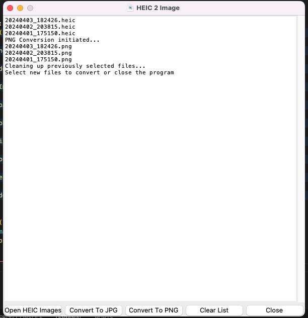
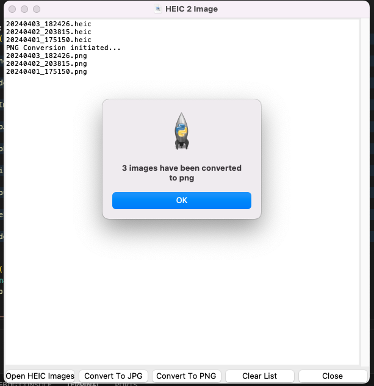

# Heic2Image

- A Python TKinter application to convert heic images to jpg/png
- Version 0.5

## Changelog
| Date | Comment |
| ---- | ------- |
| 20240419 #1 | Initial Commit |
| 20240419 #2 | Added code to make buttons similar size |


* Changelog 20240419 #2
```python
# open button
self.openImageFilesButton = tk.Button(
    master,
    text="Open HEIC Images",
    command=lambda: self.openHeicImages(self.label)
)
self.openImageFilesButton.grid(
    row=1,
    column=1,
    sticky="ew"
)
# convert to JPG button
self.convertToJPGButton = tk.Button(
    master,
    text="Convert To JPG",
    command=lambda: self.convertToJPG(self.label)
)
self.convertToJPGButton.grid(
    row=1,
    column=2,
    sticky="ew"
)
# convert to PNG button
self.convertToPNGButton = tk.Button(
    master,
    text="Convert To PNG",
    command=lambda: self.convertToPNG(self.label)
)
self.convertToPNGButton.grid(
    row=1,
    column=3,
    sticky="ew"
)
# clear list button
self.clearListButton = tk.Button(
    master,
    text="Clear List",
    command=lambda: self.clearFileList(self.label)
)
self.clearListButton.grid(
    row=1,
    column=4,
    sticky="ew"
)
# close button
self.closeButton = tk.Button(
    master,
    text="Close",
    command=lambda: self.closeWindow(master)
)
self.closeButton.grid(
    row=1,
    column=5,
    sticky="ew"
)

# Configure buttons to have same size and fill in row 2
for col in range(1, 6):
    master.grid_columnconfigure(col, weight=1, uniform="buttons")

```

## Video
<video width="640" height="480" controls>
  <source src="https://heic2image.app/demo.mp4" type="video/mp4">
</video>

## Image

